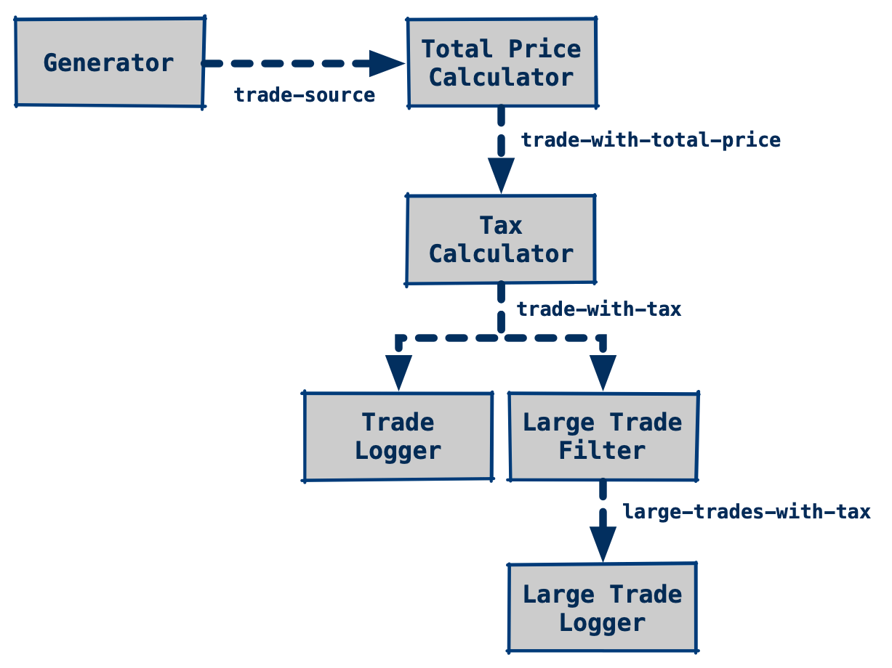
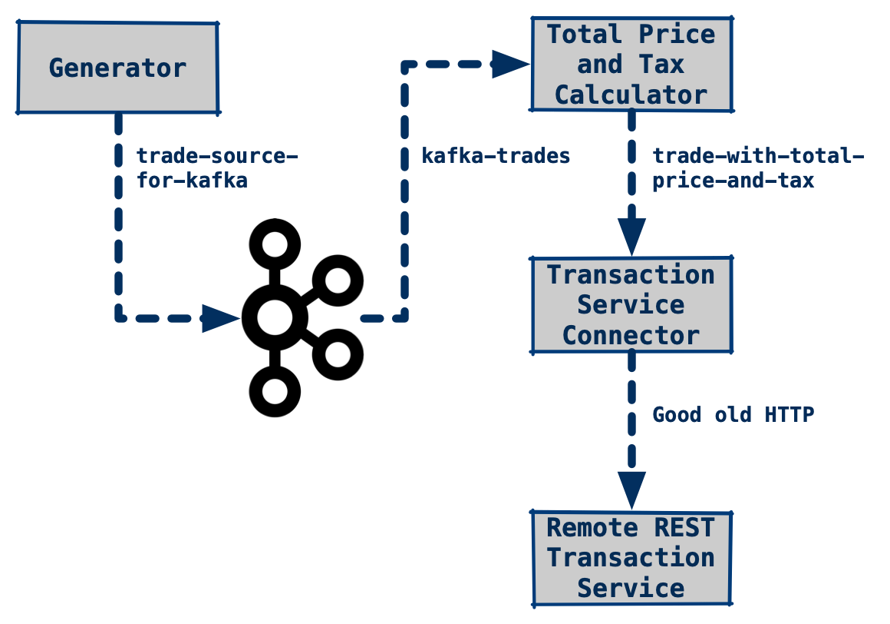

# Example with an unreliable Service, some Tracing and Monitoring, Auth Services and Message-based Communication

This project demonstrates the usage of Traefik and Docker Compose in combination with Quarkus services. It is meant as an example for the Mobile Computing 2 course at University of Applied Sciences Erfurt during 2020.

In contrast to the Dockerfiles from Quarkus project templates, the ones found in this example use multi-stage builds to simplify the process. Thus, one no longer needs to run Maven or GraalVM locally to build the project and afterwards create those containers. Instead, everything is performed during Docker image creation. Beside being easier during development, this should also help with CI/CD pipelines.

---- 

## Branch: Version 5 Message-based Communication

This version shows an example service that employes different means of message-based commication.

Messages are sent from one Class/Bean to another one via *Channels*. Each channel has a unique name and usually connects a source and a sink. However, broadcasts are possible, too. A message contains a payload and sometimes some sort of metadata. The following figure displays that concept - note that so far, messages are bound to a single service/application.


**Figure 1:** Messaging Channels (Source: [SmallRye Reactive Messaging](https://smallrye.io/smallrye-reactive-messaging/smallrye-reactive-messaging/2.7/concepts.html)).

To allow delivery of Messages between different services and applications, *Connectors* are used to link application channels to *Message Brokers*. Such systems are able to handle huge volumes of messages and are the backbone of every message-based system. One of the most popular broker systems is [Apache Kafka](https://kafka.apache.org). The next figure shows a single application that is linked to two brokers (or, more specifically, two channels/streams of the underlying broker backbone).


**Figure 2:** Messaging Channels with Connectors for External Sources and Sinks (Source: [SmallRye Reactive Messaging](https://smallrye.io/smallrye-reactive-messaging/smallrye-reactive-messaging/2.7/concepts.html)).

In our example, we will develop two different message pipelines.  

1. A strictly local message exchange example that is bound to a single service
2. A more realistic variant which employes a Kafka backbone

In both cases, a source/generator method will produce *Trades* - objects that describe a trade at a stock exchange. Further down the processing pipeline, those trade instances are enhanced/changed in several ways. In the end, they are handed over to a logger and/or sent to a REST endpoint.

So, let's have a look at the `Trade` class.

### Data Model: `Trade` Class

```kotlin
class Trade {
    var customer: String? = null
    var stock: String? = null
    var amount: Int? = null
    var pricePerStock: Double? = null
    var totalPrice: Double? = null

    constructor()
    constructor(customer: String, stock: String, amount: Int = 1, pricePerStock: Double) {
        this.pricePerStock = pricePerStock
        this.amount = amount
        this.stock = stock
        this.customer = customer
    }

    override fun toString(): String {
        return "Trade(customer=$customer, stock=$stock, amount=$amount, " +
                "pricePerStock=$pricePerStock, totalPrice=$totalPrice)"
    }
}
```

### Local, Reactive Messaging

Local message exchange in Quarkus uses the [SmallRye Reactive Messaging](https://smallrye.io/smallrye-reactive-messaging/smallrye-reactive-messaging/2.7/index.html) library, that provides abstractions for channel definition and usage. To a lesser extend, [SmallRye Mutiny](https://smallrye.io/smallrye-mutiny/) is used - a new event-driven reactive programming library. 

The following illustration shows the main building blocks of local messaging. First, we got normal methods that perform the actual work (the rectangles). Channels are defined by annoations, `@Outgoing` and `@Incoming` respectivly. Both annotations are used at method level and take the channels name as parameter. For every outgoing channel definition (e.g. source), there must be a corresponding incoming definition (e.g. the sink). Connections are strictly 1:1 by default; by using `@Broadcast` at the source, one may connect several sinks to a single source.

Regarding the data that is transmitted via those channels, method return values and parameters are captured by the framework. Thus, the return type of an outgoing method should match the parameter type of the connected incoming method.


**Figure 3:** Reactive Messaging Channel Binding.

Our example has the following general structure (see [LocalMessaging.kt](quarkus-messaging-service/src/main/kotlin/de/fhe/ai/mc/LocalMessaging.kt) for details):


**Figure 4:** Local Messageing Example.

**Note**: The Tax Calculator method is annotated with `@Broadcast`, an experimental feature that allows a stream to reach more than one receiver.

### Maven Dependency

```xml
<dependency>
    <groupId>io.quarkus</groupId>
    <artifactId>quarkus-smallrye-reactive-messaging</artifactId>
</dependency>
```

### LocalMessaging Excerpt

```kotlin
// The *Generator*
// Uses Mutiny library to generate new *Trade* instances every five seconds 
// Trade values are generated via *Faker* library
@Outgoing("trade-source")
fun generate(): Multi<Trade> {
    val faker = Faker()
    return Multi.createFrom().ticks().every(Duration.ofSeconds(5))
            .onOverflow().drop()
            .map { tick -> Trade(customer = faker.superhero().name(),
                        stock = faker.commerce().productName(),
                        amount = Random.nextInt(1, 5000),
                        pricePerStock = Random.nextDouble(0.01, 999.99)) }
}

// The *Total Price Calculator*
@Incoming("trade-source")
@Outgoing("trade-with-total-price")
fun calculateTotalPrice(trade: Trade): Trade {
    trade.totalPrice = trade.amount!! * trade.pricePerStock!!
    return trade
}

// ....
```

### [Inter-Service Messaging using Apache Kafka](https://quarkus.io/guides/kafka)

The broker-based example has the following structure (see [InterServiceMessaging.kt](quarkus-messaging-service/src/main/kotlin/de/fhe/ai/mc/InterServiceMessaging.kt) for details):


**Figure 5:** Local Messageing Example.

The `Trade` source method has an outgoing stream which will be connected to our Apache Kafka instance. From Kafka, the next processing method will read the data again. 

### Maven Dependency

Quarkus/SmallRye Reactive Messaging Kafka Connector dependency:

```xml
<dependency>
    <groupId>io.quarkus</groupId>
    <artifactId>quarkus-smallrye-reactive-messaging-kafka</artifactId>
</dependency>
```

#### `Trade` Class JSON Deserializer

To enable transmission of our `Trade` instances to Kafka, we need to provide a deserializer which transforms such instances to JSON. For transmission from Kafka, we can use the standard `JsonbSerializer` provided by the Quarkus Kafka client.

```kotlin
import io.quarkus.kafka.client.serialization.JsonbDeserializer

class TradeDeserializer : JsonbDeserializer<Trade>(Trade::class.java)
```

#### `application.properties` for Kafka Configuration

```properties
# Configure the SmallRye Kafka connector
kafka.bootstrap.servers=kafka:9092
quarkus.kafka.health.enabled=true

# Configure the Kafka sink
mp.messaging.outgoing.trade-source-for-kafka.connector=smallrye-kafka
mp.messaging.outgoing.trade-source-for-kafka.topic=kafka-trades
mp.messaging.outgoing.trade-source-for-kafka.value.serializer=io.quarkus.kafka.client.serialization.JsonbSerializer

# Configure the Kafka source
mp.messaging.incoming.kafka-trades.connector=smallrye-kafka
mp.messaging.incoming.kafka-trades.value.deserializer=de.fhe.ai.mc.TradeDeserializer
mp.messaging.incoming.kafka-trades.enable.auto.commit=true

# Configure the transaction-service (rest client)
interaction-service/mp-rest/url=http://gateway/messaging/

```

#### Docker Compose for [Apache Kafka](https://kafka.apache.org) and Zookeeper

Zookeeper is the coordination service for a Kafka cluster. Even in our case, were just a single Kafka instance is used, Zookeeper is necessary. See [docker-compose.yml](docker-compose.yml) for the full example.

```yaml
# Other stuff

########################################################
# Zookeeper Service
########################################################
zookeeper:
image: strimzi/kafka:0.19.0-kafka-2.5.0
command: [
    "sh", "-c",
    "bin/zookeeper-server-start.sh config/zookeeper.properties"
]
ports:
    - "2181:2181"
environment:
    LOG_DIR: /tmp/logs
networks:
    - mc2-quarkus-demo-network

########################################################
# Kafka Message Broker
########################################################
kafka:
image: strimzi/kafka:0.19.0-kafka-2.5.0
command: [
    "sh", "-c",
    "bin/kafka-server-start.sh config/server.properties --override listeners=$${KAFKA_LISTENERS} --override advertised.listeners=$${KAFKA_ADVERTISED_LISTENERS} --override zookeeper.connect=$${KAFKA_ZOOKEEPER_CONNECT}"
]
depends_on:
    - zookeeper
ports:
    - "9092:9092"
environment:
    LOG_DIR: "/tmp/logs"
    KAFKA_ADVERTISED_LISTENERS: PLAINTEXT://kafka:9092
    KAFKA_LISTENERS: PLAINTEXT://kafka:9092
    KAFKA_ZOOKEEPER_CONNECT: zookeeper:2181
networks:
    - mc2-quarkus-demo-network


# More other stuff
```

#### Kafka Tools

To monitor Kafka during runtime, [`kafkacat`](https://github.com/edenhill/kafkacat) can be used. It is available as Docker image, which eases its usage. The following command runs it, adds it to the Docker Compose network (`mc2`), connects it to the Kafka instance (`kafka:9092`) inside that network and monitors the `kafka-trades` stream.

```bash
docker run -it --network=mc2 edenhill/kafkacat:1.6.0 -b kafka:9092 -t kafka-trades
```

To dive deeper into Quarkus and Kafka Streams, have a look at [Quarkus - Using Kafka Streams](https://quarkus.io/guides/kafka-streams).

### [Message-based Communication and REST](https://quarkus.io/blog/kafka-rest-client/)


**Figure 6:** A Message Streams that interacts with a REST service.

## References

- SmallRye Reactive Messaging: <https://smallrye.io/smallrye-reactive-messaging/smallrye-reactive-messaging/2.7/index.html>
- SmallRye Mutiny - Event-Driven Reactive Programming Library for Java: <https://smallrye.io/smallrye-mutiny/>
- Quarkus Guide: Using Apache Kafka With Reactive Messaging: <https://quarkus.io/guides/kafka>
- Kafka Connector Documentation: <https://smallrye.io/smallrye-reactive-messaging/smallrye-reactive-messaging/2.2/kafka/kafka.html>
- Apache Kafka Quickstart: <https://kafka.apache.org/quickstart+>
- kafkacat - Apache Kafka Tool: <https://github.com/edenhill/kafkacat>
- Combining Apache Kafka and the Rest client: <https://quarkus.io/blog/kafka-rest-client/>
- Bridging Imperative and Reactive: <https://quarkus.io/blog/reactive-messaging-emitter/>
- Quarkus and Apache Kafka Streams: <https://quarkus.io/guides/kafka-streams>
- Java Faker: <https://github.com/DiUS/java-faker>
