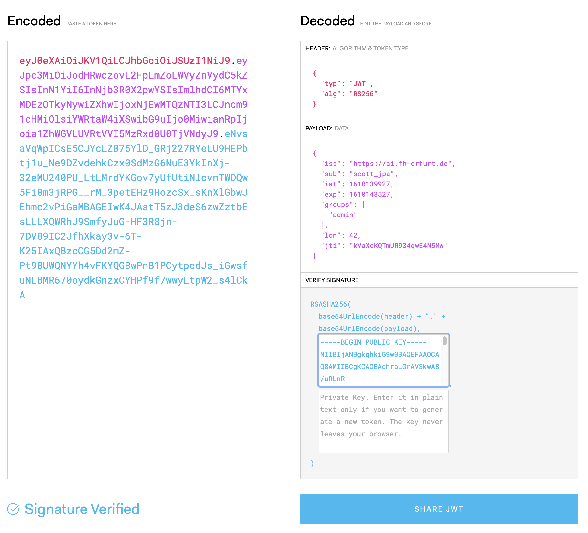

# Example with an unreliable Service, some Tracing and Monitoring and Auth Service

This project demonstrates the usage of Traefik and Docker Compose in combination with Quarkus services. It is meant as an example for the Mobile Computing 2 course at University of Applied Sciences Erfurt during 2020.

In contrast to the Dockerfiles from Quarkus project templates, the ones found in this example use multi-stage builds to simplify the process. Thus, one no longer needs to run Maven or GraalVM locally to build the project and afterwards create those containers. Instead, everything is performed during Docker image creation. Beside being easier during development, this should also help with CI/CD pipelines.

---- 

## Branch: Version 4 Security

### Authentication, Authorization and Role-based Access Control

This version demonstrates different means to secure an application, e.g. limit and control access to its REST endpoints. Quarkus itself provides several extensions which are helpful in that regard and we will have a look at three of them. But first, a bit of theory and some defintions.

Securing an applications usually requires *Authentication* and *Authorization*. The first term covers the process of getting to know who is calling, whereas the latter term is meant for all checks that ensure that a caller is allowed to access the requested resource. That access control is usually based on a fix set of roles that are assigned to different users - so called *Role-based Access Control* (RBAC).

### Basic Auth

Basic Auth is a very simple and straight forward way for HTTP-based authentication 
and authorization. Using the HTTP ```authorization``` header, a client adds username 
and password to each request. Passwords should be encrypted and, even better, the 
connection itself should be encrypted, thus providing a second layer of security.

Example Request (using IDEA Rest Client/File Format):

```curl
GET http://localhost:8080/basicauth/admin
Accept: application/json
Authorization: Basic scott boss
```

```Basic``` denotes the used auth method. Afterwards, username and password are given.

To use Basic Auth in a Quarkus service, one can choose to provide a fixed set of users and roles via property files or, much more flexible and dynamic, to store users and roles in a database. We will look at both variants in the following subsections. 

**Note:** It may be possible to combine both variants, e.g. some static user accounts via files and some other dynamic user accounts via database. However, over several attemps, sometimes it worked and sometimes it didn't...


#### [With Property Files](https://quarkus.io/guides/security-properties)

Using propety files, one may specify a limited set of users, passwords and roles which are fixed during runtime.

**Maven Dependency**

```xml
<dependency>
    <groupId>io.quarkus</groupId>
    <artifactId>quarkus-elytron-security-properties-file</artifactId>
</dependency>
```

**```application.properties``` File**

In your ```application.properties``` file, one must add several properties. The example shown below uses separate files for users and roles; it's also possible to simply put anything into the main ```application.properties``` file. However, that might lead to a large and messy property file. 

```bash
quarkus.security.users.file.enabled=true            # file based auth active
quarkus.security.users.file.users=users.properties  # Reference to the file containing users and passwords
quarkus.security.users.file.roles=roles.properties  # Reference to the file containing users and roles
quarkus.security.users.file.realm-name=mc2          # Definition of a realm, used during password encoding
quarkus.security.users.file.plain-text=false        # Sould passwords be stored as plain text (default=false)
```

**```users.properties``` File**

Values are created by MD5 hasing the following string: ```username : realm : password```. On Unix-based systems, just use the command line: ```echo -n scott:mc2:boss | md5```.

```bash
scott=0cd307b4ca7848ed87038bf12e632c7e
jdoe=6ca4db7087e0456c663596207ddb86a9
```

**```roles.properties``` File**

In that file, roles for each user are given as comma-separated list.

```bash
scott=admin,user
jdoe=user
```

**Secure an Endpoint**

```kotlin
@GET
@Path("admin")          
@Produces(MediaType.APPLICATION_JSON)
@RolesAllowed("admin")      // <-- Here one specifies the allowed roles
fun helloAdmin(@Context securityContext: SecurityContext): String =
        "Hello Admin " + securityContext.userPrincipal.name
```

#### [With Database \& JPA/Panache](https://quarkus.io/guides/security-jpa)

Using a database to store users and roles allowes for much more flexibility. First, add the following dependency to your ```pom.xml```.

**Maven Dependency**

```xml
<dependency>
    <groupId>io.quarkus</groupId>
    <artifactId>quarkus-security-jpa</artifactId>
</dependency>
```

**```application.properties``` File**

As expected, a database configuration is needed. 
**Note**: Some properties have changed lately (~Quarkus 1.10), for example ```quarkus.datasource.db-kind``` is needed now instead of a driver.

```bash
quarkus.datasource.db-kind=h2
quarkus.datasource.username=username
quarkus.datasource.jdbc.url=jdbc:h2:mem:user_db
quarkus.datasource.jdbc.max-size=5
quarkus.hibernate-orm.database.generation=drop-and-create
```

**User Model**

We need to define a user model class with some annotations which will be used by the framework automatically.

```kotlin
@Entity
@UserDefinition             // <-- Note this
class User {
    @Id
    @GeneratedValue
    var id: Long? = null
    @Username               // <-- And that
    lateinit var username: String
    @Password               // <-- As well as this
    lateinit var password: String
    @Roles                  // <-- And that
    lateinit var role: String

    override fun toString(): String {
        return "User(id=$id, username=$username, password=$password, role=$role)"
    }
}
```

**User Repository \& Test Users**

To add some test users, we created a repository class and a startup listener.

```kotlin
@ApplicationScoped
class UserRepository: PanacheRepository<User> {
    fun add(username: String, password: String, role: String) {
        val user = User()
        user.username = username
        user.password = PasswordUtils.hashPassword(password)
        user.role = role
        persist(user)
    }
}
```

```kotlin
@Singleton
class Startup {

    @Inject
    lateinit var userRepository: UserRepository

    /*
        Helper method to add some test users to our in-memory db.
        Observes the startup event to run before anything else.
     */
    @Transactional
    fun loadUsers(@Observes evt: StartupEvent?) {
        userRepository.deleteAll()
        userRepository.add("scott_jpa", "boss", "admin")
        userRepository.add("jdoe_jpa", "password", "user")
    }
}
```

**Endpoints**

Look exactly the same as with files-based auth.

### JWT/Bearer Auth

In this section, we take a look at an alternative to Basic Auth: *JSON Web Tokens* (JWT), or based on the keyword, sometimes referred to as *Bearer Auth*. 

#### JSON Web Token (JWT)

JWTs are used to authenticate and authorize access to resources. They follow well-defined structure

```
<Header>.<Payload>.<Signature>
```

and allow for the secure exchange of claims between two parties and things like Single Sign On (SSO). 

The header contains general information like the signing algorithm used and token type (*jwt* most of the time).

The payload contains all the claims associated with this token. Claims are statements about the entity the token
is assigned to (e.g. usually the user). A third party may trust those claims after the token was verified successfully. 
Beside some standard claims like **iss** (issuer) or **exp** (expiration time) one might add as much custom claims as
needed. The payload is Base64Url encoded.

To create the signature part one has to take the encoded header, the encoded payload, a secret, the algorithm specified in the header, and sign that. The signature is used to verify the message wasn't changed along the way, and, in the case of tokens signed with a private key, it can also verify that the sender of the JWT is who it says it is.


**Figure 1:** A JSON Web Token analyzed on [JWT.io](https://jwt.io)

[Encode & Decode Token](https://www.jsonwebtoken.io)

**Generating Private/Public Keys for Usage with JWT**

```bash
# Private Key
openssl req -newkey rsa:2048 -new -nodes -keyout privatekey.pem -out csr.pem
# Public Key
openssl rsa -in privatekey.pem -pubout > publickey.pem
```

#### [Using JWT with Quarkus](https://quarkus.io/guides/security-jwt) 

First, it seems that one cannot use Basic and Bearer Auth in the same service. As soon as the JWT extension is added to a Quarkus service, Basic Auth requests are rejected with a note that Bearer Auth is required.

**Maven Dependency**

To use JWTs in your service, add the following dependencies to your ```pom.xml```. First one is the JWT extension itself, second one is need for converting JSON to Java/Kotlin objects - a feature needed during login/token creation.

```xml
<dependency>
    <groupId>io.quarkus</groupId>
    <artifactId>quarkus-smallrye-jwt</artifactId>
</dependency>
<dependency>
    <groupId>io.quarkus</groupId>
    <artifactId>quarkus-resteasy-jsonb</artifactId>
</dependency>
```

**```application.properties``` File**

Several additions to our application property file are needed:

```bash
quarkus.smallrye-jwt.enabled=true               # JWT/Bearer Auth enabled
mp.jwt.verify.publickey.location=publicKey.pem  # Location of the public key file (relative to src/main/resources)
mp.jwt.verify.issuer=https://ai.fh-erfurt.de    # Issuer Reference
de.fhe.ai.jwt.duration=3600                     # Token Valid Time in seconds

```

**Database & Model**

We reuse the database config as well as the user model from Basic Auth with Database/JPA example above. But several other model classes are needed, for example a class holding username and password used in the token generation process. Have a look at `JwTModel.kt` for details.

**Token Generation**

The class `JwtTokenUtils` offers a method to generate new token based on a given user, a duration and an issuer. We use it in our `login` endpoint in `JwtAuthResource`:

```kotlin
@PermitAll
@POST
@Path("/login")
@Produces(MediaType.APPLICATION_JSON)
fun login(authRequest: AuthRequest): Response {

    val user: User? = userRepository.find("username", authRequest.username).firstResult()

    return if (user != null && PasswordUtils.verifyPassword(authRequest.password, user.password)) {
        try {
            val newToken = JwtTokenUtils.generateToken(user, duration!!, issuer!!)
            Response.ok(AuthResponse(newToken)).build()
        }
        catch (e: Exception) {
            Response.status(Response.Status.UNAUTHORIZED).build()
        }
    }
    else {
        Response.status(Response.Status.UNAUTHORIZED).build()
    }
}
```

To issue a login request, the following request may be used:

```bash
POST http://localhost:8080/jwtauth/login
Accept: application/json
Content-Type: application/json

{
   "username": "scott",
   "password": "boss"
}
```

**Token Usage/Verification**

All other endpoint methods in `JwtAuthResource` are annotated with `@RolesAllowed` and thus secured. Handling and verification of JWT tokens that are part of a request is performed automatically. Have a look at the `admin` endpoint, that uses an injected instance of `JsonWebToken` (at class level) to access the payload of the submitted JWT token.

```kotlin
@RolesAllowed("admin")
@GET
@Path("/admin")
@Produces(MediaType.APPLICATION_JSON)
fun admin(@Context securityContext: SecurityContext): Response? {

    println(securityContext.userPrincipal.name)
    println(jwt.name)
    println(jwt.issuer)
    println(jwt.claimNames)
    println(jwt.getClaim<String>("lon"))

    return Response.ok(Message("Content for admin")).build()
}
```

## References

- Quarkus Basic Auth with Property Files: <https://quarkus.io/guides/security-properties>
- Quarkus Basic Auth with Database & JPA: <https://quarkus.io/guides/security-jpa>
- Short Tutorial for JWT and Quarkus: <https://ard333.medium.com/authentication-and-authorization-using-jwt-on-quarkus-aca1f844996a>
- Quarkus Datasources: <https://quarkus.io/guides/datasource>

