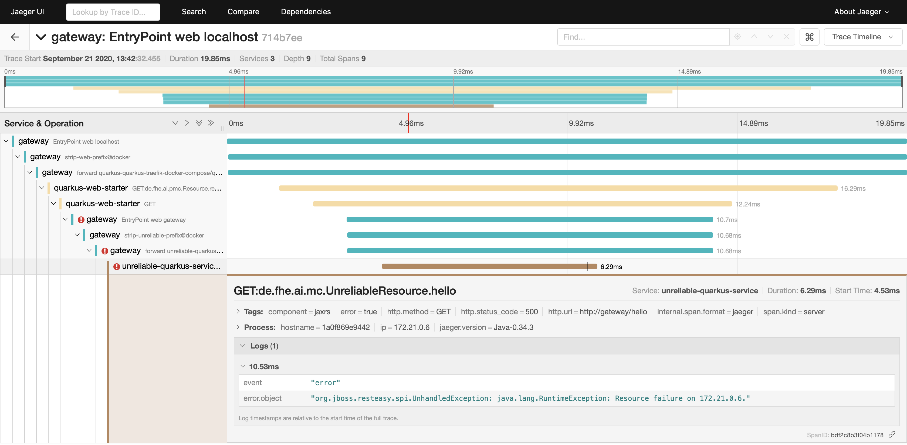
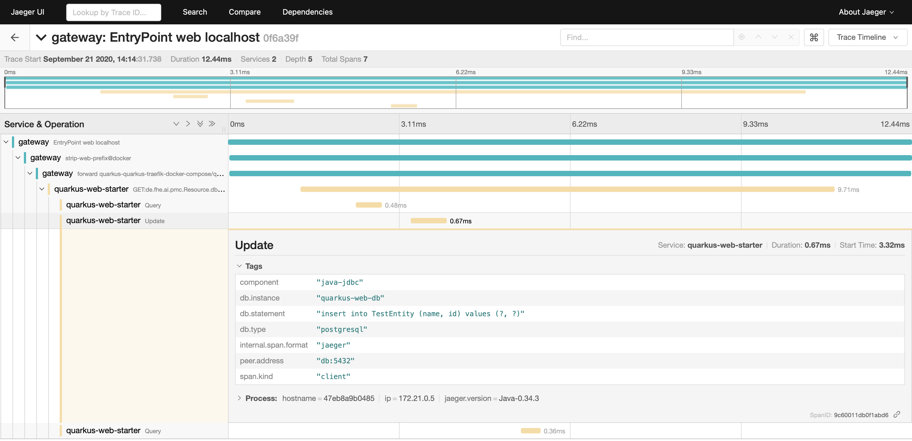
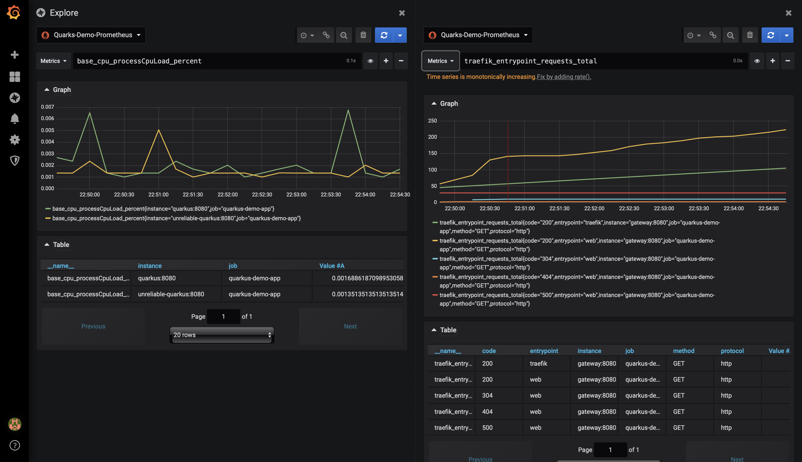

# Example with an unreliable Service and some Tracing and Monitoring

This project demonstrates the usage of Traefik and Docker Compose in combination with Quarkus services. It is meant as an example for the Mobile Computing 2 course at University of Applied Sciences Erfurt during 2020.

In contrast to the Dockerfiles from Quarkus project templates, the ones found in this example use multi-stage builds to simplify the process. Thus, one no longer needs to run Maven or GraalVM locally to build the project and afterwards create those containers. Instead, everything is performed during Docker image creation. Beside being easier during development, this should also help with CI/CD pipelines.

---- 

## Branch: Version 3 Tracing and Monitoring

This is the third version of the example. It's based on the second version and demonstrates how to handle tracing and monitoring in a microservice environment.

**Important Note:** After changing your Quarkus services configuration, don't forget to rebuild the corresponding Docker images!

So, what has changed, what is new in this version?

### Tracing

In a distributed system with several components possibly spanning various networks, it is important to know if all parts are working together as planned. In contrast to a classic monolith where following the path of execution can be achieved by extensive logging (or debugging), this kind knowledge is much more difficult to acquire in a microservice environment. One needs to follow a request throughout the system, trace possible subsequent requests and even database accesses. Building such a thing from scratch would probably dwarf the actual implementation costs. 

Luckily, there a already a number of frameworks that can help. Most noteably, there is the [ OpenTracing](https://opentracing.io) effort, a [Cloud Native Foundation](https://cncf.io) project, that defines vendor-neutral APIs for tracing and provides libraries for various programming languages. Even better, Quarkus offers an [extension](https://quarkus.io/guides/opentracing) to integrate OpenTracing into your project. Using that extension, all your REST endpoints are traced automatically. You can even opt-in to trace database calls by using a special [JDBC provider](https://quarkus.io/guides/opentracing#jdbc) (more on that later). 

Beside instrumenting your code for tracing, you need a system to collect & store those traces. We will use [ Jaeger](https://www.jaegertracing.io) in this example, because it is one of the most widely used tools in that regard. For alternatives, have a look at the OpenTracing pages.

Jaeger comes with a number of tools (agent, collector, UI, ...) that can be used with an [all-on-one Docker image](https://www.jaegertracing.io/docs/1.19/getting-started/#all-in-one). Note however, that by using the default config, Jaeger will store the collected data in memory, e.g. all will be lost upon restart! So, for production, one should consider one of the [available storage options](https://www.jaegertracing.io/docs/1.19/deployment/#storage-backends).  

**Jaeger Setup with Docker Compose**

In your prototype, we will start Jaeger along the other services using Docker Compose. The corresponding entry looks like follows:

```yml
services:

  ########################################################
  # Tracing Service / Jaeger
  ########################################################
  tracing:
    image: jaegertracing/all-in-one:latest
    environment:
      COLLECTOR_ZIPKIN_HTTP_PORT: 9411
      QUERY_BASE_PATH: /tracing
    ports:
      - "5775:5775/udp"
      - "6831:6831/udp"
      - "6832:6832/udp"
      - "5778:5778"
      - "16686:16686"
      - "14268:14268"
      - "9411:9411"
    labels: 
      - "traefik.enable=true"
      - "traefik.http.routers.tracing.rule=Host(`localhost`) && PathPrefix(`/tracing`)"
      - "traefik.http.routers.tracing.entrypoints=web"
      - "traefik.http.services.tracing.loadbalancer.server.port=16686"

    # ... other services
```

Note the large required number of port for the different Jaeger agents and collectors. We also configure a Traefik route for the Jaeger UI.

**Enable Tracing in your Quarkus Services**

Next, we need to integrate OpenTracing into our services. First, we need to add the OpenTracing extension to our project. Either by calling 

```bash
./mvnw quarkus:add-extension -Dextensions="smallrye-opentracing"
````

or by adding it directly into the dependencies section:

```xml
<dependency>
    <groupId>io.quarkus</groupId>
    <artifactId>quarkus-smallrye-opentracing</artifactId>
</dependency>
```

Second, the Open Tracing extension provides a number of configuration parameters that can be added to your `application.properties`. Your should at least give each service unique name to differentiate between them. For example:

```bash
quarkus.jaeger.service-name = quarkus-web-starter
```

Third, we need to tell your services the address of your Jaeger service. We do this in our Docker Compose file. The following excerpt just shows the relevant parts - the new `environment` sections allows for the definition of environment parameters just as if they have been given at the command line. We configure the agents address as well as the general Jaeger endpoint.

```yml
# ... other stuff

########################################################
# Quarkus Service
########################################################
quarkus:
  build: 
    # skipped...
  labels:
    # skipped...
  environment: 
    JAEGER_AGENT_HOST_PORT: "tracing:6831"
    JAEGER_ENDPOINT: "http://tracing:14268/api/traces"
  depends_on:
    # skipped...

# ... more stuff
```

**_Optional_**: Fourth, we can apply a special JDBC driver to also trace the database access. One needs to add the following dependency:

```xml
<dependency>
    <groupId>io.opentracing.contrib</groupId>
    <artifactId>opentracing-jdbc</artifactId>
</dependency>
```

Afterwards, you can adapt your database configuration in your `application.properties` in the following way:

```bash
quarkus.datasource.db-kind = postgresql
quarkus.datasource.jdbc.url = jdbc:tracing:postgresql://db:5432/quarkus-web-db
quarkus.datasource.jdbc.driver = io.opentracing.contrib.jdbc.TracingDriver
```

The driver (class) will be the same for all different database systems, but don't forget to specify the database kind (e.g. `postgresql` in our case). Moreover, note the new `tracing` in our database url! 

**Enable Tracing for the Traefik Gateway**

Due to the fact that all inbound traffic as well as the traffic between our services is routed through the Traefik controller, it would be wise to also trace that component. Otherwise, our traces would not be complete, or more specifically, broken up into several chunks - not exactly what we aimed to do. Luckily, Traefik also supports OpenTracing and all configuration can be done in our Docker Compose file as follows:

```yml
########################################################
# Reverse Proxy / Traefik
########################################################
gateway:
  image: "traefik:v2.2.7"
  command:
    # ... some stuff skipped ...

    # Tracing Config
    - --tracing=true
    - --tracing.servicename=gateway
    - --tracing.jaeger=true
    - --tracing.jaeger.samplingserverurl=http://tracing:5778/sampling
    - --tracing.jaeger.localagenthostport=tracing:6831
    - --tracing.jaeger.collector.endpoint=http://tracing:14268/api/traces?format=jaeger.thrift
  ports:
    # ... skipped
  volumes:
    # ... skipped
  labels:
    # ... skipped        
  depends_on:
    - tracing
```

That's it! Just run `docker-compose build` and `docker-compose up` to rebuild all images and start the system. Head over to the [Jaeger UI](http://localhost/tracing) to check the traces as they appear. Don't forget to actually *use* the system. Otherwise, there would be no traces.

The following two screenshots show different traces in the Jaeger UI. The first one shows a request that ended up in our unreliable service (marvelously failing as intended) and the second on follows a request into the database, where queries and an update happen. 


**Figure 1:** Jaeger UI with a failed request to our unreliable service.


**Figure 2:** Jaeger UI with a request that leads to database access/changes.


### Metrics using Prometheus

Beside tracing, another important aspect in a distributed system are application resp. service metrics. They should tell you, how your system performs regarding min, max and mean response times, cpu and memory load, and so on. [MicroProfile Metrics](https://github.com/eclipse/microprofile-metrics) offers a standard API for integrating metric collection into your services and Quarkus [fully supports](https://quarkus.io/guides/microprofile-metrics) that API.   

To integrate them, the following steps are necessary:

Add the extension dependency:

```xml
<dependency>
  <groupId>io.quarkus</groupId>
  <artifactId>quarkus-smallrye-metrics</artifactId>
</dependency>
```

And adapt your code - here, we annotate some methods of the `Resource` class in our `quarkus-web-starter` service.

The `hello` endpoint will be annotated with `@Counted` and `@Timed` to simply collect the total number of requests to and measure the performance of that endpoint. Furthermore, we annotate an additional method with `@Gauge` that will simply collect the current number of database entries.

```kotlin
@GET
@Path("/hello")
@Produces(MediaType.TEXT_PLAIN)
@Counted(name = "hellosRequested", description = "How many request on the Hello resource have been performed.")
@Timed(name = "timeToDelivderHello", description = "A measure of how long it takes to handle the hello request.", unit = MetricUnits.MILLISECONDS)
fun hello() = "hello from ${getIpAddresses()}"
```

And a new function that will simply provide the number of database entries. This will be monitored as [gauge](https://prometheus.io/docs/concepts/metric_types/#gauge):

```kotlin
@Gauge(name = "numberOfDbEntries", description = "The number of db entries.", unit = MetricUnits.NONE)
@Transactional
fun getNumberOfDbEntries() = repository.count()
```

After building and starting, our Quarkus service would now publish it's metrics under a special REST endpoint. However, having a system that would collect and store all metrics from all services of our system would very useful. Luckily, [ Prometheus](https://prometheus.io) is the de-facto standard in that regard. Let's add it to our system.  

In our Docker Compose file, add the Prometheus service:

```yml
########################################################
# Prometheus - Metrics Collector Service
########################################################
metrics:
  image: prom/prometheus
  ports: 
    - "9090:9090"
  volumes:
    - $PWD/prometheus/config.yml:/etc/prometheus/prometheus.yml
    - metrics-data:/prometheus
```

Create a new folder in our working dir, `prometheus`, which contains the following configuration in a `prometheus.yml` file:

```yml
global:
  # How often should Prometheus request metrics data from services
  scrape_interval: 5s  

  external_labels:
    monitor: 'quarkus-demo-monitor'

# Which services should be monitored? What is the base path of each service where the metrics are published? 
scrape_configs:
  - job_name: 'quarkus-demo-app'
    metrics_path: '/metrics'
    static_configs:
      - targets: [
        'gateway:8080', 
        'quarkus:8080',
        'unreliable-quarkus:8080', 
        'tracing:14269'
        ]
```

And don't forget to define the new volume required by Prometheus:

```yml
volumes: 
  db-data:
  metrics-data: # <-- new!
```

Beside our own services, Traefik is also able published metrics data - so, let's activate that:

```yml
gateway:
  image: "traefik:v2.2.7"
  command:
    # Enable Metrics for Prometheus
    - --metrics.prometheus=true
  
  # ... rest of the config ... 
```

Well, you are done. Build your services with 


```bash
docker-compose build
```

and start the system.

```bash
docker-compose up
```

Then, make some requests to [http://localhost/web/hello](http://localhost/web/hello) as well as [http://localhost/web/db-test](http://localhost/web/db-test) to generate some data.

Open the simple Prometheus UI on [http://localhost:9090](http://localhost:9090).

To view the raw metrics data from quarkus-web-starter, go to [http://localhost/web/metrics](http://localhost/web/metrics).

### Metrics Dashboard with Grafana

If you got here, you probably got Prometheus and MicroProfile Metrics up and running. You will also have noticed that the Prometheus UI to examine metrics data is rather simple. A better interface with more options and visualizations would be helpful -- and [ Grafana](https://grafana.com) delivers on that front.  

Add the Grafana service to your Docker Compose file:

```yml
########################################################
# Grafana - Metrics UI Service
########################################################
metrics-ui:
  image: grafana/grafana
  volumes:
    - "./grafana/grafana.ini:/etc/grafana/grafana.ini"
    - "metrics-ui-data:/var/lib/grafana"
  environment:
    - GF_SERVER_ROOT_URL=https://localhost/metrics-ui
    - GF_SERVER_DOMAIN=localhost
  labels: 
    - "traefik.enable=true"        
    - "traefik.http.middlewares.strip-metrics-ui-prefix.stripprefix.prefixes=/metrics-ui"
    - "traefik.http.routers.metrics-ui.rule=Host(`localhost`) && PathPrefix(`/metrics-ui`)"
    - "traefik.http.routers.metrics-ui.entrypoints=web"
    - "traefik.http.routers.metrics-ui.middlewares=strip-metrics-ui-prefix@docker"
    - "traefik.http.services.metrics-ui.loadbalancer.server.port=3000"
  depends_on: 
    - metrics
```

Create a folder `grafana` and an empty grafana.ini file. That one might be used for addition initializations.

Moreover, add a third volume to your Docker Compose file:

```yml
volumes: 
  db-data:
  metrics-data: 
  metrics-ui-data: # <-- new!
```

Run `docker-compose up` to start the additional service. Got to [http://localhost/metrics-ui](http://localhost/metrics-ui), you will be prompted by a login screen. Use `admin/admin` to login, you will be asked to change the password. Afterwards, a wizard is presented - the first step will be to add a data source. We will use our Prometheus service. Give the data source a nice name and enter `http://metrics:9090` as URL. Hit `Save & Test`. 

Select the `Explore` button to the left. On that page, you can select your metric of interest from the drop down menu at the top. 

Look around, Grafana is huge. And have fun building nice dashboards :-)


**Figure 3:** Grafana UI.

### Bonus: Logging to Sentry.io

Last but not least, collecting and navigating log messages from your whole system becomes a burden if any of your services just logs to `stdout`. There are a couple of options regarding [log management on Quarkus](https://quarkus.io/guides/centralized-log-management). However, beside being free, they all require you to run a more or less complex stack of additional systems -- a bit to much for our little project. But there is a simpler option: [ Sentry.io](https://sentry.io). A paid cloud service, that offers a sufficient free tier - and, if your needs grow, you are free to run [their open source stack](https://develop.sentry.dev/self-hosted/). 

Adding Sentry to your Quarkus project is a breeze with the [official extension](https://quarkus.io/guides/logging-sentry) -- just add the dependency and set your Sentry project URL and all log messages will appear in the Sentry UI. Better yet, Sentry also offers libraries for Android and iOS, so you can collect and merge log messages from your whole system.

So, add the dependency:

```yml
<dependency>
    <groupId>io.quarkus</groupId>
    <artifactId>quarkus-logging-sentry</artifactId>
</dependency>
```

And configure you Sentry.io endpoint and log level in your `application.properties`:

```bash
# Sentry.io Logging Config
quarkus.log.sentry=true
# You may specify, which log messages from what packages will be captures. Use `*` to simply capture all, even from used libraries and so on. 
quarkus.log.sentry.in-app-packages=de.fhe.ai.pmc
# The log level -- in production, `INFO` is probably not a good idea...
quarkus.log.sentry.level=INFO
quarkus.log.sentry.dsn=https://<something>@<another-thing>.ingest.sentry.io/<some-number>
# Give a unique name so you can differentiate messages from different services
quarkus.log.sentry.environment=quarkus-web-starter
```

That's it. Just start [logging in Quarkus](https://quarkus.io/guides/logging) and have your messages appear in Sentry.io.


**Figure 4:** Sentry.io UI with several log messages from our example app.

### Final words

By now, you will have noticed that running a microservice-based application involves may aspect that need to be considered and a lot of additional services to help you maintain, run and troubleshot your system. When you look at our Docker Compose file, you will notice that right now, there are a lot more services for *housekeeping* than actual application services. Luckily, we have now laid the foundation and can now start to add more useful services.

----

## Run the example

You need Docker and Docker Compose installed on your system. 

1. Clone the repo and run the following command from root folder:

    `docker-compose up`

2. Access Traefik Dashboard by pointing your browser to <http://localhost>

3. Access Endpoints

    *From Version 1* 

    Access Hello Endpoint from Quarkus service: <http://localhost/web/hello>
    
    Access DB Test Endpoint from Quarkus service: <http://localhost/web/db-test>
 
    *From Version 2*
    
    Access Retry Endpoint from Quarkus service: <http://localhost/web/remote-retry-hello>

    Access Fallback Endpoint from Quarkus service: <http://localhost/web/remote-fallback-hello>

    Access Timeout Endpoint from Quarkus service: <http://localhost/web/remote-timeout-hello>

    Access Circuit Breaker Endpoint from Quarkus service: <http://localhost/web/remote-circuit-breaker-hello>

    *From Version 3*

    **New** Access Jaeger UI to check your traces: <http://localhost/tracing>

    **New** Access Prometheus UI to check your metrics: <http://localhost:9090>

    **New** Access Grafana UI to check for beautiful metrics and dashboards: <http://localhost/metrics-ui>


4. Run in detached mode (e.g. in background):

    `docker-compose up -d`

    `docker-compose -p mc2 up`
    
    Option `-p` to set a project name. Without it, the parent folder name is used. Should lead to nicer service names in Traefik too.

5. Restart single service (in this case `quarkus`)

    `docker-compose up quarkus`

6. Rebuild images during startup:

    `docker-compose up --build`

7. Scale a singe service (in this case, start three instances of the quarkus service):

    `docker-compose up --scale quarkus=3`

    Traefik will pick up all instances and offer a simple loadbalancer. You can check this by invoking the `hello` endpoint - the response contains the containers IP address which should be different on subsequent invokations.

8. Stop the system:

    `docker-compose down`

For a full Docker Compose reference see: <https://docs.docker.com/compose/reference/overview/>

## Quarkus JVM or Native Mode

Have a look at `docker-compose.yml` lines 113-115 resp. 149-151 -- depending on the used Dockerfile, Docker Compose will either run the JVM or Native version. See those Dockerfiles for more information.

## References

- Quarkus - Using Open Tracing: <https://quarkus.io/guides/opentracing>
- MicroProfile OpenTracing with Jaeger and Quarkus: <https://www.youtube.com/watch?v=iqHcTmqj-mo>
- Prometheus: <https://prometheus.io>
- Quarkus - MicroProfile Metrics: <https://quarkus.io/guides/microprofile-metrics>
- Grafana: <https://grafana.com>
- Sentry.io: <https://sentry.io>
